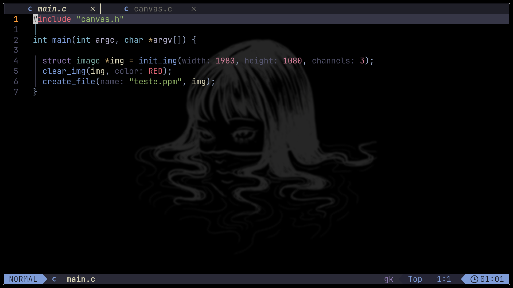
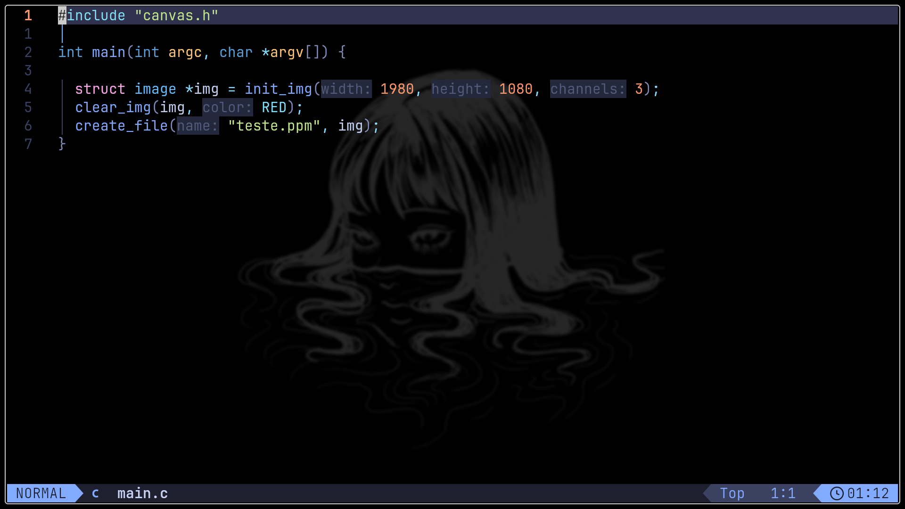
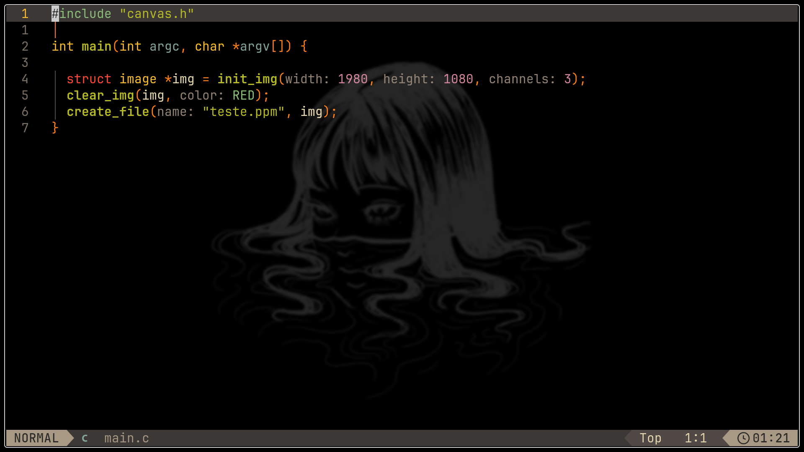
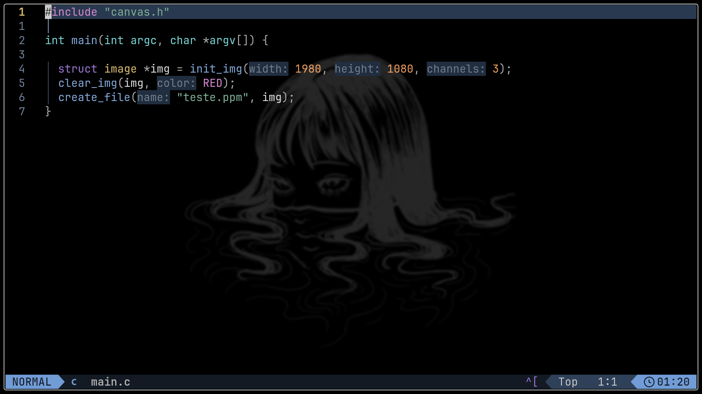
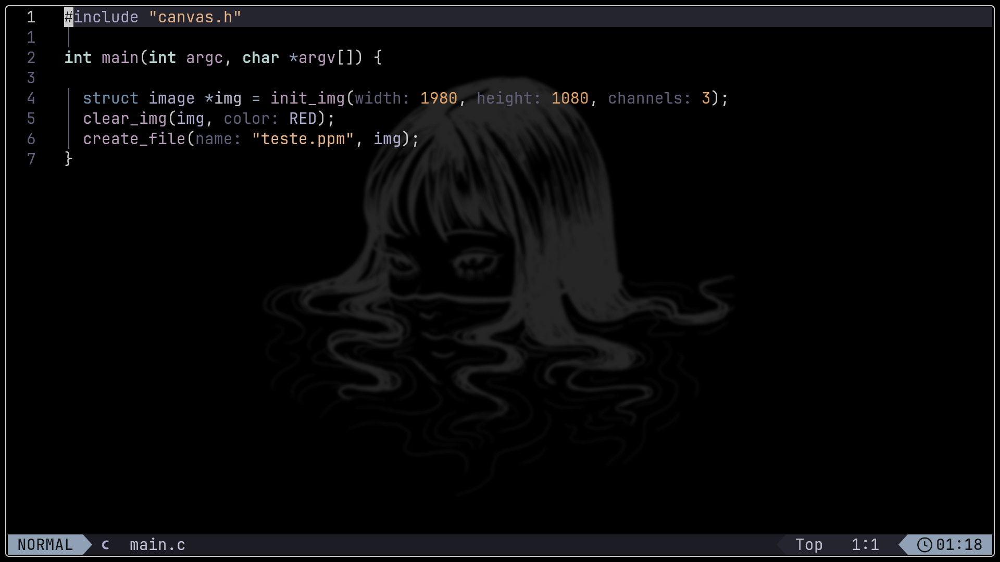
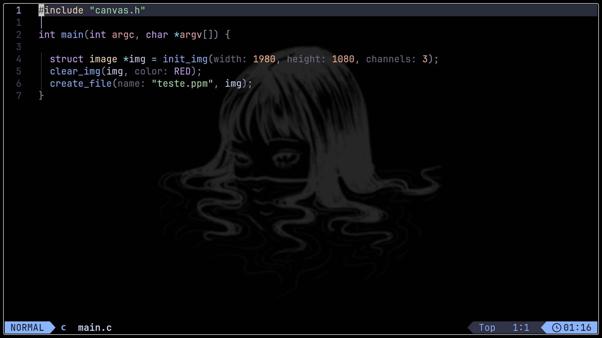

# ⚙️ yuri-nvim — Personal [Lazy.nvim](https://github.com/LazyVim/LazyVim/blob/main/README.md) Configuration

A clean, fast and minimalist Neovim configuration built with **Lazy.nvim**.
Designed for speed, modularity and easy to use.

## ✨ Features

- 🚀 Fast startup powered by Lazy.nvim
- 🎨 Curated colorschemes (Kanagawa, Tokyonight, Catppuccin, Gruvbox, Nightfox, Vague, Cyberdream)
- 🧠 Clean modular Lua architecture
- 🛠️ Easy to customize and extend
- 📦 Plugin-based design
- ⚡ Optimized for daily development

## 📷 Previews

<p align="center">
  
  <br>
  <em>Kanagawa – Dragon</em>
</p>

<p align="center">
  
  <br>
  <em>Tokyonight – Moon</em>
</p>

<p align="center">
  
  <br>
  <em>Cyberdream</em>
</p>

<p align="center">
  
  <br>
  <em>Gruvbox</em>
</p>

<p align="center">
  
  <br>
  <em>Nightfox</em>
</p>

<p align="center">
  
  <br>
  <em>Vague</em>
</p>

<p align="center">
  
  <br>
  <em>Catppuccin – Mocha</em>
</p>

## 📂 File Structure

```
/.config/nvim
├── lua
│   ├── config
│   │   ├── autocmds.lua
│   │   ├── keymaps.lua
│   │   ├── lazy.lua
│   │   └── options.lua
│   └── plugins
│       ├── themes
│       │    ├── catppuccin.lua
│       │    ├── cyberdream.lua
│       │    ├── gruvbox.lua
│       │    ├── nightfox.lua
│       │    ├── rose-pine.lua
│       │    ├── tokyonight.lua
│       │    └── vague.lua
│       └── example.lua
└── init.lua
```

## 🎨 Changing the Colorscheme

Edit ```lua/config/lazy.lua```
and set:
 ```vim.cmd.colorscheme("colorscheme-name")```
 to one of the following:

- kanagawa
- tokyonight
- catppuccin
- gruvbox
- nightfox
- vague
- cyberdream
